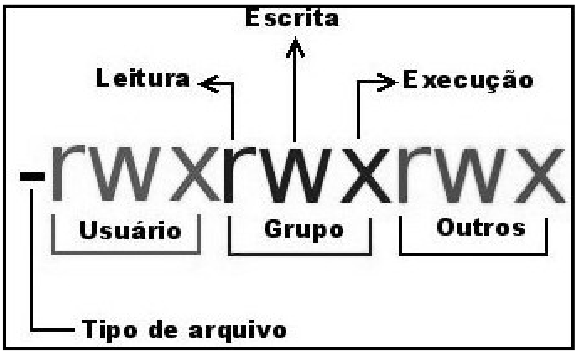

# Permissões avançadas e ACL



- r = read 4
- w = write 2
- x = execute 1

> chmod, modo simbólico ou octal. Controla permissões do arquivo.

`g = group | o - outros | u = user`  
- Simbólico
    - `chmod g=w` torna igual
    - `chmod g=w` adiciona

> chown, altera o grupo e dono do arquivo

`chown user:group arquivo`

## Permissões especiais

- suid (4) usuário
- sgid (2) grupo
- stick bit (1) dono

- setfacl
    - `setfacl -m user:group:rwx arquivo`
    ```bash
    -rwxrwxr--+ 1 root root 9 jun  8 01:04 string
              +
              ++> Configurado ACL
    ```
    - `setfacl -m group:user:rwx arquivo`
- getfacl
    - `getfacl arquivo`